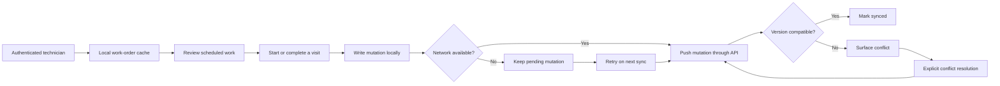

# FieldOps

FieldOps is an offline-first field-service management application for technicians who need to review work orders, record service visits, and synchronize updates even when connectivity is unreliable. The project focuses on the difficult part of field software: preserving a productive local workflow while making synchronization, retries, versioning, and conflicts visible instead of silently losing changes.

## Core workflow



The application maintains a local view of work orders, visits, and queued mutations. A technician can continue working offline, while a later synchronization pass sends pending changes to the server. Version numbers and a server-side mutation ledger make retries idempotent and allow the client to distinguish synchronized, pending, failed, and conflicting records.

## Main features

| Feature | What it demonstrates |
| --- | --- |
| Work-order management | Scheduled, in-progress, completed, and needs-review states with low, standard, and urgent priorities. |
| Field-visit workflow | Start and complete visits, record notes, and complete site-access, safety, and service checklists. |
| Offline-first local state | Expo SQLite and AsyncStorage preserve the working set and queued mutations on the device. |
| Conflict-aware synchronization | Entity versions, mutation IDs, retry states, and explicit conflict-resolution actions prevent silent overwrites. |
| Authentication | User-scoped records and protected API procedures keep work orders and visits separated by account. |
| Mobile and web delivery | Expo Router supports native navigation and an Expo web target from the same TypeScript codebase. |
| Backend persistence | Drizzle ORM migrations model users, work orders, visits, and the synchronization ledger in PostgreSQL. |

## Architecture

The mobile client is built around a field-service provider that owns the local cache, mutation queue, synchronization state, and technician actions. It communicates with the backend through typed tRPC procedures and React Query. The server validates ownership, applies version-aware mutations, records applied client mutation IDs, and returns a snapshot that the client merges into its local store.

The persistence model includes:

| Entity | Purpose |
| --- | --- |
| `users` | Authenticated users and application roles. |
| `field_work_orders` | Customer, service-site, schedule, priority, status, equipment, version, and update metadata. |
| `field_visits` | Visit timing, notes, checklist state, work-order association, and version metadata. |
| `sync_mutation_ledger` | Idempotency and audit information for create, update, and conflict-resolution mutations. |

## Technology stack

| Layer | Technologies |
| --- | --- |
| Mobile/web client | Expo 54, React Native, Expo Router, React Native Web, TypeScript |
| UI and interaction | NativeWind, React Navigation, Expo Haptics, safe-area handling |
| Local persistence | Expo SQLite, AsyncStorage, Secure Store |
| Data access | tRPC, TanStack React Query, Zod, SuperJSON |
| Backend | Node.js, Express, TypeScript, `tsx` |
| Database | PostgreSQL, Drizzle ORM, Drizzle Kit |
| Testing and quality | TypeScript checks, Expo lint, Prettier, Vitest |

## Local development

The project uses `pnpm`.

```bash
git clone https://github.com/AYANOKOJI-71/fieldops.git
cd fieldops
pnpm install
```

Configure the database, authentication, and API environment variables required by the runtime, then run the database migrations and start both the API and Expo web development servers:

```bash
pnpm db:push
pnpm dev
```

Useful commands include:

```bash
pnpm check
pnpm lint
pnpm test
pnpm format
pnpm android
pnpm ios
```

`pnpm dev` starts the backend and Metro/Expo processes together. The `android` and `ios` scripts require a suitable local Expo development environment.

## Design decisions

FieldOps treats synchronization as a user-visible product concern rather than an implementation detail. Mutations have stable client IDs so retrying a request does not apply the same change twice. Records carry versions so the server can reject stale updates instead of silently overwriting newer work. The client exposes pending, failed, and conflict states so a technician can understand what still needs attention.

The project is a portfolio reference implementation and should be connected to production identity, database, and observability controls only after the deployment environment has been configured and reviewed.

## Author

Built by **Sarowar Hossain Rony**.
